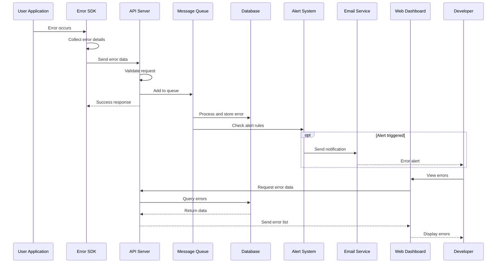

# Error Logging Service Architecture

## Overview

This document describes the architecture for an error logging service that helps developers track and fix bugs in their applications. The service captures errors from user applications, stores them, and provides a dashboard to view and analyze these errors.

## System Flow Diagram



## 1. Client SDK

### What it is
A JavaScript library that developers add to their applications to automatically catch and send errors to our service.

### Technology Choice: JavaScript/TypeScript
- **Key functions:**
  - Data Collection:
    - Error: message, type, stack trace.
    - Environment: URL, User Agent, language, resolution (web); OS, hostname (backend).
    - User: session ID, user ID (if available).
    - Context: event log, application state, performance metrics.

  - Data Processing:
    - Fingerprinting: creates a unique error "fingerprint" to group identical errors.
    - Sampling: sends only a subset of errors to avoid overload.
    - Compression: reduces data size before sending.

  - Data Delivery:
    - Async: doesn't block application operation.
    - Reliable: retries on failure, local storage fallback.
    - Batched: sends multiple errors in one request.

## 2. API Backend

### What it is
The server that receives errors from client SDKs, processes them, stores them in appropriate storage (MongoDB, PostgreSQL, Elasticsearch), and triggers notifications.

### Technology Choice: Node.js with Express/Nest.js
 - **Queue Processing:** RMQ / Kafka/ Amazon SQS / Amazon SNS for asynchronous processing
 - **Caching:** Redis for rate limiting and temporary storage
 - **Search:** Elasticsearch client for error indexing

**Key Features:**
 - Validation: Checking error data structure
 - Authentication: Verifying client API keys
 - Rate Limiting: Protection against DDoS and abuse
 - Batch Processing: Distributing errors to processing queues
 - Indexing: Sending data to Elasticsearch for search

### API Endpoints Example

| What it does | URL | Limit |
|-------------|-----|-------|
| Send one error | POST /api/errors | 100 per minute |
| Send multiple errors | POST /api/errors/batch | 20 per minute |
| Get error list | GET /api/errors | 300 per minute |
| Get error details | GET /api/errors/:id | 600 per minute |

**Request Processing Flow:**
1.Validation → 2. Authentication → 3. Rate Limiting → 4. Add to queue → 5. Instant client response → 6. Async queue processing (save to MongoDB + index to Elasticsearch + alert checks)

## 3. Web Dashboard

### What it is
Web interface for developers with complete error overview, search, analytics and notification management.

### Technology Choice: React, Redux Toolkit / Zustand, Material-UI / Ant Design, WebSocket / Server-Sent Events
- **Why**: Fast, modern, and has great developer tools
- **Real-time**: Updates automatically when new errors arrive
- **Features**:
  - Search: Full-text search via Elasticsearch
  - Filtering: By error type, date, status, application
  - Grouping: Automatic grouping of identical errors
  - Statistics: Trend charts, top errors, frequency
  - Alerts: Alert configuration (email, Slack, Telegram)
  - Team: Shared project access, user roles
- **Main Pages & Components**:
  - Dashboard: Overall statistics, activity charts
  - Error List: Table with search and filters
  - Error Details: Stack trace, context, reproduction steps
  - Analytics: Detailed period reports
  - Settings: Projects, notifications, team

## 4. Real-time Alerts

### What it is
Immediate notifications when critical errors happen in applications.

### Technology Choice: RabbitMQ/Kafka + SendGrid/Postmark/Resend
- **Why**: Reliable message delivery and professional email service
- **Channels**:
  - Email notifications
  - Slack messages
  - SMS (optional)
- **Key Features**:
  - Smart rules: Algorithms for detecting new and critical errors
  - Throttling & cooldowns: Avoiding spam during mass errors
  - Escalation: Automatic notification redirects without response
  - Customization: Configuring notification templates for different error types
- **Alert Types**:
  - Critical errors: 500+ errors, application crashes
  - New errors: First occurrence of unique errors
  - Frequency spikes: Sudden increase in error counts
  - Personal alerts: Assigned to specific developers
- **Rule Configuration**:
  - Trigger conditions: Error type, frequency, application
  - Recipient groups: Distribution by teams and projects
  - Notification hours: Time restrictions for off-hours
  - Priority levels: Alert criticality levels

## 5. DevOps Solution
### **AWS-Based Architecture with Kubernetes**
### **1. Infrastructure as Code (IaC)**
- **Terraform** for provisioning all infrastructure (VPC, EKS, databases)
- **AWS CloudFormation** for auxiliary resources
### **2. Containerization & Orchestration**
- **Docker** for packaging all components (API, workers, dashboard)
- **Amazon EKS (Kubernetes)** for orchestration:
  - **Namespaces** for component isolation (api, workers, dashboard)
  - **Horizontal Pod Autoscaler** for automatic scaling
  - **Resource limits** for memory and CPU control
  ### **3. Databases & Storage**
- **MongoDB Atlas** - fully managed MongoDB (Hot storage)
- **Amazon RDS PostgreSQL** - for Warm storage
- **Amazon OpenSearch** - fully managed Elasticsearch (search & analytics)
- **Amazon S3 + Glacier** - Cold storage (archive)
### **4. Networking & Security**
- **Amazon VPC** with private and public subnets
- **Application Load Balancer** for API and dashboard
- **Security Groups** and **Network Policies** for microservice security
- **AWS WAF** for DDoS protection
### **5. Queuing & Messaging**
- **Amazon SQS** for error processing queues
- **Amazon SNS** for notifications (email, SMS, Slack integrations)
### **6. Monitoring & Logging**
- **Prometheus + Grafana** for Kubernetes and application metrics
- **AWS CloudWatch** for AWS service metrics
- **Loki + Grafana** for logs
- **X-Ray** for request tracing
### **7. CI/CD Pipeline**
```yaml
# GitHub Actions workflow:
- Build Docker images
- Security scanning (Trivy)
- Unit tests
- Deploy to Staging EKS
- Integration tests
- Auto-deploy to Production (on success)
- Automatic rollback on failure
```
### **8. Auto-Scaling Strategy**
- **API pods**: scale based on CPU (60% threshold)
- **Worker pods**: scale based on SQS queue length
- **Databases**: vertical scaling + read replicas
### **9. Security**
- **Secrets management**: AWS Secrets Manager
- **Encryption at rest**: for all databases
- **Encryption in transit**: TLS everywhere
- **Regular security scans**: automated vulnerability scanning

## Key Technical Decisions
### 1. Why JavaScript Everywhere?
- One language for the entire system
- Huge community and lots of tools
- Easy to find developers
- Great for real-time features

### 2. Rate Limiting
- **Free tier**: 1,000 errors per hour
- **Pro tier**: 10,000 errors per hour
- **Enterprise**: Custom limits

### 3. Security
- All data encrypted
- API keys for authentication
- Automatic removal of passwords and personal info
- GDPR compliant

### 4. Performance Goals
- Error capture: Under 1 millisecond
- API response: Under 100 milliseconds
- Dashboard load: Under 2 seconds

## Developer Questions for Platform Owner

### Business Questions
1. How many customers do you expect?
2. How many errors per day should we handle?
3. What's your pricing model?
4. Who are your competitors?
5. What's your budget?

### Technical Questions
6. Which programming languages need support?
7. Do you need mobile app support?
8. What integrations do you need (Slack, Jira, etc.)?
9. Do you need on-premise deployment option?
10. What's your uptime requirement (99.9% or 99.99%)?

### Feature Questions
11. How long should we keep error data?
12. Do you need source map support for minified code?
13. Should similar errors be grouped automatically?
14. Do you need custom fields for errors?
15. What kind of search capabilities do you need?

### User Questions
16. Who will use this (developers, managers, support)?
17. How technical are your users?
18. Do you need role-based access control?
19. What reports do users need?
20. Do you need a mobile app?

### Compliance Questions
21. Do you need GDPR compliance?
22. Any data residency requirements?
23. Do you need SOC 2 certification?
24. What about HIPAA compliance?
25. Any industry-specific regulations?

### Future Questions
26. Do you want to add performance monitoring later?
27. Any plans for log aggregation?
28. Interest in making parts open source?
29. Plans for AI-powered error analysis?
30. When do you need the MVP ready?
